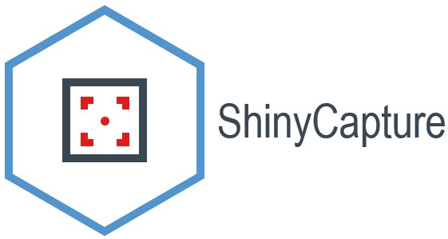

# ShinyCapture



Package to facilitate taking easy screenshots of webpage elements in a RShiny Web Application. This package incorporates [html2canvas](https://html2canvas.hertzen.com/) script using the awesome `shinyjs` package by [Dean Attali](https://deanattali.com/) to take neat and tidy screenshots.

How to install
--------------

Run the below command to install the package

``` r
devtools::install_github("sarthi2395/ShinyCapture")
```

Sample App
----------

````r
library(shiny)
library(shinyjs)
library(ShinyCapture)

ui <- fluidPage(
  useShinyCapture(),
  titlePanel("ShinyCapture - A Demo"),
  
  sidebarLayout(
    sidebarPanel(
      width = 3,
      sliderInput("bins",
                  "Number of bins:",
                  min = 1,
                  max = 50,
                  value = 10),
      radioButtons("selectPlot", "What would you like to download?", choices = c("Grey Plot" = 1, "Red Plot" = 2, "Both the plots" = 3, "Entire Webpage" = 4), inline = FALSE),
      actionButton("download","Download", icon = icon("download"))
    ),
    
    mainPanel(
      div(id="plots",
          fluidRow(
            column(width = 6,
          plotOutput("distPlot")),
          column(width = 6,
          plotOutput("distPlot2")))
      )
    )
  )
)

server <- function(input, output) {
  
  output$distPlot <- renderPlot({
    x    <- faithful[, 2] 
    bins <- seq(min(x), max(x), length.out = input$bins + 1)
    hist(x, breaks = bins, col = 'darkgray', border = 'white', main = "Grey Plot")
  })
  output$distPlot2 <- renderPlot({
    x    <- faithful[, 2] 
    bins <- seq(min(x), max(x), length.out = input$bins + 1)
    hist(x, breaks = bins, col = 'red', border = 'black', main = "Red Plot")
  })
  
  observeEvent(input$download,{
    
    if(input$download==1){
      Capture("distPlot","Grey Plot","jpg")
    }else if(input$download==2){
      Capture("distPlot2","Red Plot","jpg")
    }else if(input$download==3){
      Capture("plots","Both the plots","jpg")
    }else if(input$download==4){
      Capture("html","Entire Webpage","jpg")
    }
      
    
  })
  
}

shinyApp(ui = ui, server = server)
````

You can also find a demo app [here](https://sarthi2395.shinyapps.io/shinycapture).
